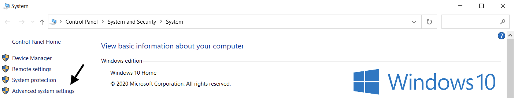

# Chatbot 参考文档

# 前端

相关文件位于/web文件夹下

## assets

该文件夹放置了一些png媒体文件，用于用户头像等

## css

### style.css

提供了page.html使用的css文件

## js

### config.js

<aside>
⚠️ **注意：**
const cuid = "ciy7xg9p600003sxo5b70c99d";

供测试使用，默认添加了一个cuid

</aside>

提供了基本的配置文件

包括但不限于：

- 媒体文件（assets）地址
- 服务器地址（默认为localhost：8080）
- 录制文件格式（默认为audio/webm;codecs=opus)
- 采样率等（默认为160000/16bits)详情参见[百度语音识别文档](https://cloud.baidu.com/doc/SPEECH/s/Jlbxdezuf)
- 用于录制（时间）的开始与结束时间延迟

### Recorder.js

简易的录音方法，用于在HTML页面通过用户麦克风录制音频

### script.js

一些基础的JS方法，包括但不限于：

- 创建用户和机器人回复的聊天气泡
- 为HTML页面中按钮分配功能
- 上传文本或音频文件
- 得到服务器回复并使用相应HTML元素显示

## HTML

### Page.html

简易的演示界面

# 后端

位于/serverside文件夹下

### access_token.json

用于储存获取的access token和时间戳

access token有效期一般为（30天），详情参考[百度相关文档](https://cloud.baidu.com/doc/SPEECH/s/Pk38y8m7k)

### audio_config.json

为百度的api提供的配置文件

recognization_params 为[语音识别](https://cloud.baidu.com/doc/SPEECH/s/Jlbxdezuf)相关参数

synthesis_params为[语音合成](https://ai.baidu.com/ai-doc/SPEECH/mlbxh7xie)相关参数

详细参数相关请参考以上超链接（百度官方文档）

### audiotextprocess.py

提供了音频和文字相关操作函数

包括但不限于：

- 调用api进行语音识别
- 调用api进行语音合成
- 音频文件格式转换（初始demo状态仅包括webm_bytes_to_wav_bytes）

### bot_config.json

chatbotBaidu.py需要的相关配置

包括但不限于：

- 文言千帆模型api 对应url
- header

详情请参照 [文言千帆大模型文档](https://cloud.baidu.com/doc/WENXINWORKSHOP/index.html)

### chatbotbaidu.py

基于百度文言千帆api的建议聊天机器人函数

包括但不限于：

- 回复用户文本输入
- 回复用户语音输入
- （基于聊天记录）生成故事

### config_utils.py

一些工具函数

获取access token 生成cuid啥的

### initialize.py

初始化百度api相关acess token

读取本地环境变量中的api key 和 secret key

关于如何[获取api key 和 secret key](https://cloud.baidu.com/doc/SPEECH/s/Pk38y8m7k#%E9%89%B4%E6%9D%83%E8%AE%A4%E8%AF%81%E6%9C%BA%E5%88%B6)

关于设置环境变量

**Windows设置**

**选项1：** 通过cmd提示设置您的“OPENAI_API_KEY”环境变量

在cmd提示符中运行以下命令，将<yourkey>替换为您的[API密钥](https://beta.openai.com/account/api-keys)：

`setx BAIDU_API_KEY "<你的密钥>"`

这将适用于未来的cmd提示符窗口，因此您需要打开新的窗口才能使用该变量进行curl操作。您可以通过打开新的cmd提示符窗口并键入以下内容来验证是否已设置此变量：

`echo %BAIDU_API_KEY%`

**选项2：** 通过控制面板设置您的“OPENAI_API_KEY”环境变量

1. 打开**系统**属性，选择**高级系统设置**

win10：

win11:

1. 选择**环境变量...**

1. 在用户变量部分（顶部）选择**新建...**添加您的名称/密钥值对，将<yourkey>替换为您的[API密钥](https://beta.openai.com/account/api-keys)。

`变量名称：BAIDU_API_KEY 变量值：<yourkey>`

**Linux / MacOS设置**

**选项1：** 使用zsh设置您的“OPENAI_API_KEY”环境变量

在终端中运行以下命令，将yourkey替换为您的[API密钥](https://beta.openai.com/account/api-keys)。

`echo "export BAIDU_API_KEY='yourkey'" >> ~/.zshrc`

更新shell以使用新变量：

`source ~/.zshrc`

使用以下命令确认您已设置您的环境变量。

`echo $BAIDU_API_KEY`

您的API密钥的值将是输出结果。

BAIDU_SECRET_KEY 设置同理

也可以使用json 方法载入

请重写initialize_api_key() 方法以便使用你意愿的方法载入相关密钥

### simpleserver.py

基于flask框架的建议python 服务器端app

包括但不限于：

- 处理并回复/uploadText的用户文字输入
- 处理并回复/uploadAudio的用户音频输入
- 处理并回复/story的生成故事请求
- 一些对音频或是文字内容的处理函数
- 一些用以保存聊天记录的辅助功能函数

# 关于如何使用

## 服务器端

cd 到serverside文件夹

python simpleserver.py

## 用户端

直接打开page.html

# 附录

如果需要使用java去运行相关scripts里面的functions

推荐使用ProcessBuilder

[相关使用方法](https://www.baeldung.com/java-working-with-python)
